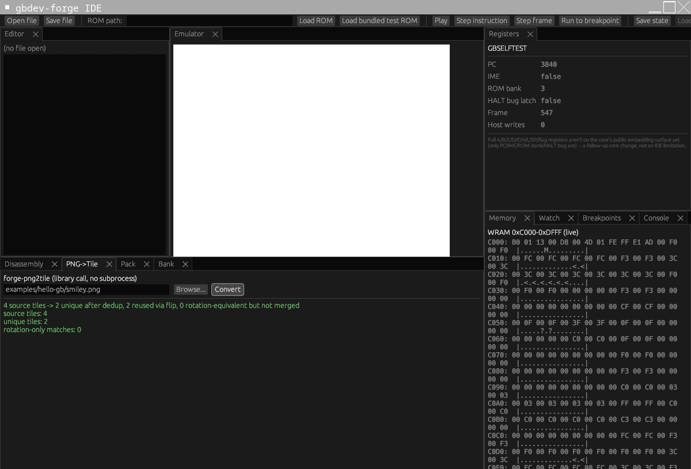
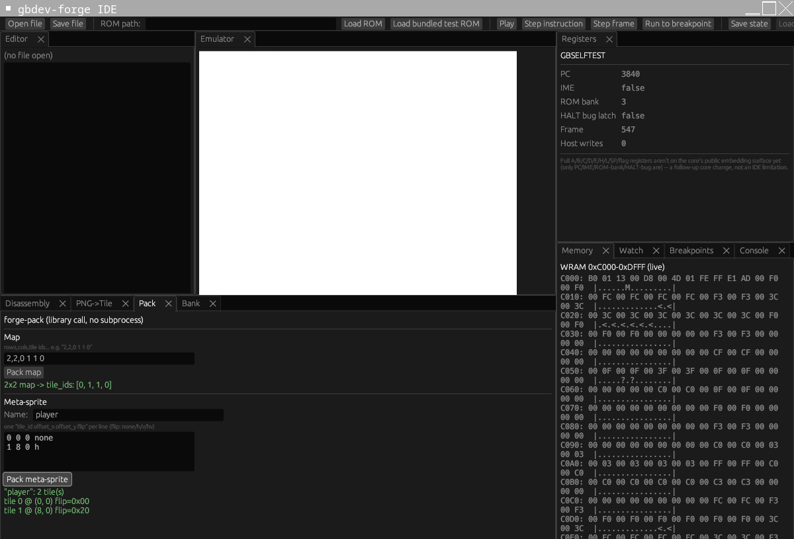
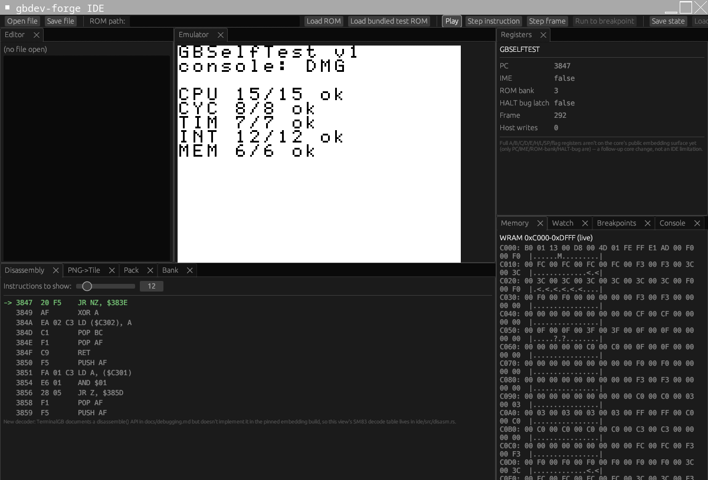
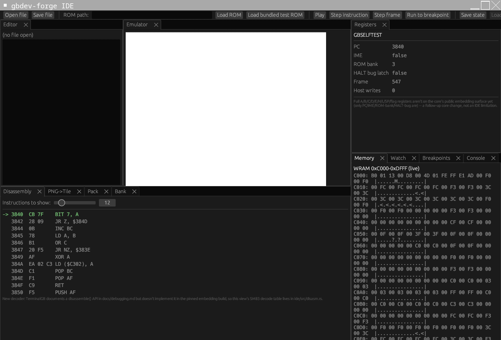
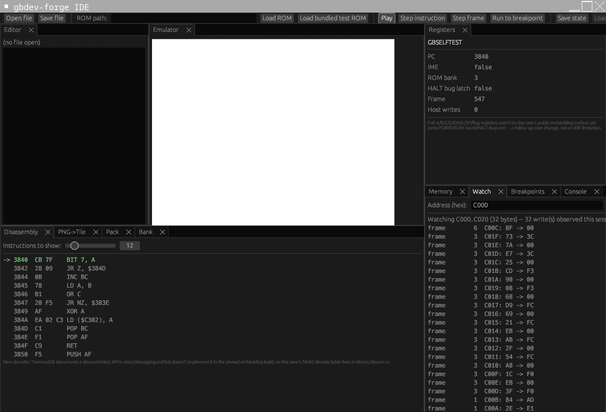
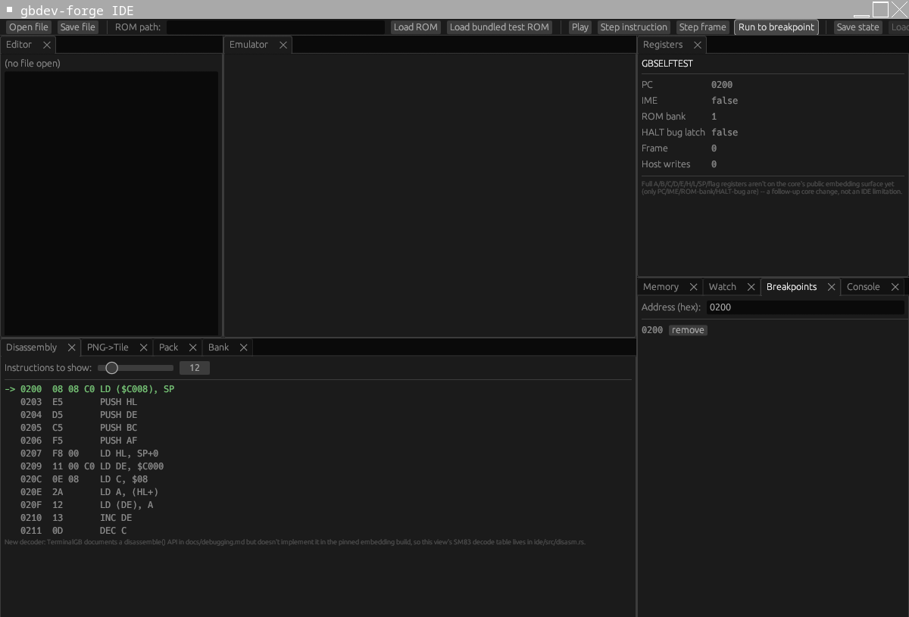

<p align="center">
  
</p>

<p align="center"><strong>A code-first Rust toolchain for building real Game Boy games - converter, packer, bank allocator, and a live debugger IDE, no drag-and-drop required.</strong></p>

No node-based visual authoring - real code, a real built-in run/debug layer, and a shared
virtual-hardware model used by both static checks and live runtime instrumentation. Game Boy
Advance support is planned later on top of the same core crates.

Design spec: see the firstmate fleet's `data/gbdev-ide-spec/report.md`.

## Contents

- [Features](#features)
- [Screenshots](#screenshots)
- [Getting started](#getting-started)
- [Status](#status)
- [Roadmap / TODO](#roadmap--todo)

## Features

- **`forge-core`** - shared types (`Tile`, `Palette`, project manifest) used by every other crate.
- **`forge-png2tile`** - PNG to Game Boy 2BPP tile converter, bit-for-bit verified against real
  `rgbgfx` output. Auto-deduplicates tiles across identity/horizontal-flip/vertical-flip/180°, so
  repeated and solid-colour tiles collapse to one, with a before/after tile-count report.

  
- **`forge-pack`** - map and meta-sprite packer: turns `forge-png2tile`'s tile references into a
  compact tile-ID index array for backgrounds, or a tileId/offsetX/offsetY/flip tuple list for
  multi-tile sprites.

  
- **`forge-bank`** - MBC (MBC1/3/5) bank allocator: greedily packs bankable items into 16KB banks,
  honours explicit pins, and emits an RGBDS-compatible linker-script fragment. Overflow is a hard
  error naming exactly what didn't fit and by how much - never a silent wrap.
- **`ide/`** - an `egui` desktop application tying the above together in one window:
  - A GB/GBC core (TerminalGB) embedded and running live - play, pause, single-instruction step,
    single-frame step.

    
  - A disassembly view of the next few real CPU instructions and a memory viewer (WRAM) updated
    live from the running core.

    
  - An address read/write watch (frame-over-frame diff).

    
  - A breakpoint list that actually pauses execution when hit - exactly on the breakpoint address,
    not past it.

    
  - Panels for `forge-png2tile` and `forge-pack`, calling their library code directly rather than
    shelling out (screenshots above).
  - A basic text file editor.
- **`examples/hello-gb`** - a minimal real example (a hand-assembled `.asm` stub plus a
  `forge-png2tile`-generated tile asset) to open and poke at.
- **`docs/getting-started.md`** / **`docs/usage.md`** - how to build, run the IDE, and use every
  tool above, with a full concrete walkthrough.

## Screenshots

All six below are real captures of the actual `forge-ide` binary running (under Xvfb, driving the
embedded TerminalGB core against the bundled `gbselftest.gb` ROM), not mockups.

| | |
|---|---|
|  Emulator running a real ROM |  Live memory + disassembly |
|  Breakpoint pausing execution exactly |  Address watch log |
|  `forge-png2tile` panel |  `forge-pack` panel |

## Getting started

```sh
cargo build --workspace
cargo test --workspace
cargo run -p forge-ide
```

See [`docs/getting-started.md`](docs/getting-started.md) for the panel tour and
[`docs/usage.md`](docs/usage.md) for a full task-by-task walkthrough (loading a ROM, setting a
breakpoint, using the memory viewer and address watch, running the asset tools from inside the
IDE) - every step in that guide was actually run and verified, not just described.

## Status

Early build, in active development. The pieces above exist and are tested; there is no released
version and the on-disk project-file format is not yet stable.

## Roadmap / TODO

- Audio driver (`forge-audio`): MIDI/tracker input to raw writes on the Game Boy's four sound
  channels.
- Visual map/collision painter and an NPC/event script DSL compiling to a small bytecode VM,
  layered over the same artifacts the CLI tools already produce.
- The shared virtual-hardware model: a single cartridge + full-address-space model used for BOTH
  build-time fit/overlap checking of declared memory regions AND live runtime violation detection
  (stray writes outside a declared region, dead allocations) - currently only the IDE's raw
  address watch exists; the declared-region/violation layer on top of it is not built yet.
- Game Boy Advance backend (`forge-gba`): a genuinely separate pipeline (4bpp/8bpp tiles, flat
  address space, no classic bank-switching), targeting the `agb` Rust crate as the GBA runtime -
  not started.
- Plugin API: still an open design question - in-process Rust trait vs. a WASM component model for
  untrusted third-party plugins.
- AI integration: still an open design question - likely scope is DSL-script assistance and
  bank-overflow explanations first, nothing further decided.
- Savestate persistence: the IDE's save/load state already round-trips through TerminalGB's own
  `save_state`/`load_state`, but only to an in-memory slot - not yet written to disk.
